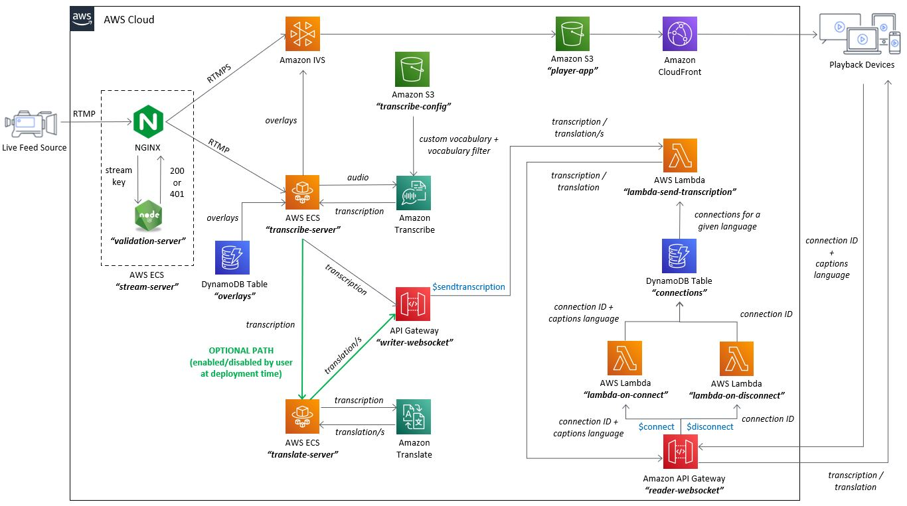

# Amazon IVS Auto-captions Web demo

> [!CAUTION]
> **This code sample is a proof of concept designed exclusively for educational purposes**. It is **not** intended for production use. Its primary goal is to help you understand the concepts and capabilities of AWS services. **DO NOT** use this solution in any production environment. By using this solution, you understand and accept its risks and limitations.

A demo web application for demonstrating how you can use Amazon IVS in conjunction with Amazon Transcribe to deliver real-time captions for live streams. This demo also shows how Amazon Translate can be used to deliver auto-translated captions to viewers (optional during deployment).

**This project is intended for education purposes only and not for production usage.**

This is a serverless web application, leveraging [Amazon IVS](https://aws.amazon.com/ivs/), [Amazon Transcribe](https://aws.amazon.com/transcribe/), [Amazon ECS](https://aws.amazon.com/ecs/), [Amazon API Gateway](https://aws.amazon.com/api-gateway/), [AWS Lambda](https://aws.amazon.com/lambda/), [Amazon DynamoDB](https://aws.amazon.com/dynamodb), [Amazon S3](https://aws.amazon.com/s3/) and [Amazon CloudFront](https://aws.amazon.com/cloudfront/). The web user interface is a single page application built using [React.js](https://reactjs.org/) and the [Amazon IVS Player](https://docs.aws.amazon.com/ivs/latest/userguide/player.html). The demo showcases how you can add real-time live captioning to an Amazon IVS stream using Amazon Transcribe. It also showcases how to configure image overlays to appear on top of the video player based on specific keywords, using [TimedMetadata](https://docs.aws.amazon.com/ivs/latest/userguide/metadata.html). This demo uses [Amazon API Gateway WebSockets](https://docs.aws.amazon.com/apigateway/latest/developerguide/apigateway-websocket-api.html) to deliver the captions to the connected clients, which are then used as a WebVTT track.

 

## Getting Started
### ⛔️ This demo is experimental, and should only be used for educational purposes. Do not use this solution in any production environment. By deploying this solution, you understand and accept its risks and limitations.
⚠️ *Deploying this demo application in your AWS account will create and consume AWS resources, which will cost money.*

To get the demo running in your own AWS account, follow these instructions.

1. If you do not have an AWS account, please see [How do I create and activate a new Amazon Web Services account?](https://aws.amazon.com/premiumsupport/knowledge-center/create-and-activate-aws-account/)
2. Log into the [AWS console](https://console.aws.amazon.com/) if you are not already. Note: If you are logged in as an IAM user, ensure your account has permissions to create and manage the necessary resources and components for this application.
3. Follow the instructions for deploying to AWS.

### Deploying to AWS
* To deploy this demo, follow the [deployment instructions](./deployment/README.md).
* Once deployed, to configure (optional), follow the [configuration instructions](./configuration/README.md).

 

## Architecture

 

## ⚠️ Known issues and limitations
* The solution was built for demonstration purposes only and **not for production use**.
* The solution requires streaming to an ECS container instead of directly to Amazon IVS, which may add points of failure and additional latency.
* The solution is currently **limited to a maximum connected viewers of ~200** (this limitation comes from the captions delivery mechanism, not Amazon IVS). Starting from 200 connected users and up, the execution time of the process to deliver the captions to connected clients increases and causes a timeout in the Lambda function (which is set at 3 seconds), resulting in captions not being delivered at all. A possible alternative approach to overcome this limitation would require replacing the WebSocket infrastructure (built on top of API Gateway, Lambda and DynamoDB) with a custom WebSocket Server implementation running in Amazon ECS and AWS Fargate. Read more [here](./docs/supporting-more-viewers.md).
* The solution's client-side caption syncing mechanism currently relies on an undocumented Player API. This API may be changed or deprecated in the future without notice.
* In Firefox, captions may appear very close to the bottom border of the video when there are 4 or more rows of captions.
* The solution was only tested in **us-west-2 (Oregon)** and **us-east-1 (N. Virginia)** regions. Additional regions may be supported depending on service availability.
* You may explore using [this demo](https://github.com/aws-samples/amazon-transcribe-streaming-live-closed-captions) as an alternative, which has fewer limitations.

 

## Estimated costs
Deploying this solution in your AWS account will create and consume AWS resources, which will cost money. 

Below is a table with estimated costs for scenarios with 1, 10, and 100 viewers, each receiving video in 1080p resolution during 1 hour with four translations enabled.

> Note: These costs are estimates. Cost may vary depending on multiple factors such as (but not limited to) region, amount of viewers, duration, number of captions in the video, enabling the Translate feature, the number of translations that are activated, etc. Note that the estimated prices are in dollars and do not include taxes.

 

| Service                                                              | 1 viewer | 10 viewers | 100 viewers |
| -------------------------------------------------------------------- | -------: | ---------: | ----------: |
| [Amazon Translate](https://aws.amazon.com/translate/pricing/)               |    30.78 |      30.78 |       30.78 |
| [Elastic Container Service](https://aws.amazon.com/fargate/pricing/) |     2.27 |       2.27 |        2.27 |
| [Interactive Video Service](https://aws.amazon.com/ivs/pricing/)     |     2.15 |        3.5 |          17 |
| [Transcribe](https://aws.amazon.com/transcribe/pricing/)             |     0.73 |       0.73 |        0.73 |
| [CloudWatch](https://aws.amazon.com/cloudwatch/pricing/)             |     0.09 |       0.09 |        0.09 |
| [DynamoDB](https://aws.amazon.com/dynamodb/pricing/on-demand/)       |     0.02 |       0.25 |         2.5 |
| [API Gateway](https://aws.amazon.com/api-gateway/pricing/)           |     0.02 |       0.25 |         2.5 |
| [Elastic Container Registry](https://aws.amazon.com/ecr/pricing/)    |     0.09 |       0.09 |        0.09 |
| [Lambda](https://aws.amazon.com/lambda/pricing/)                     |     0.00 |       0.02 |        0.25 |
| [S3](https://aws.amazon.com/s3/pricing/)                             |     0.00 |       0.00 |        0.00 |
| [CloudFront](https://aws.amazon.com/cloudfront/pricing/)             |     0.00 |       0.00 |        0.02 |
| Total estimated cost                                                           |    36.15 |      37.98 |       56.23 |

 

## About Amazon IVS
* Amazon Interactive Video Service (Amazon IVS) is a managed live streaming solution that is quick and easy to set up, and ideal for creating interactive video experiences. [Learn more](https://aws.amazon.com/ivs/).
* [Amazon IVS docs](https://docs.aws.amazon.com/ivs/)
* [User Guide](https://docs.aws.amazon.com/ivs/latest/userguide/)
* [API Reference](https://docs.aws.amazon.com/ivs/latest/APIReference/)
* [Learn more about Amazon IVS on IVS.rocks](https://ivs.rocks/)
* [View more demos like this](https://ivs.rocks/examples)
