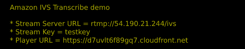
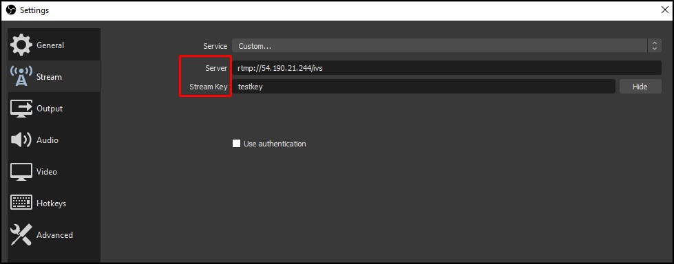
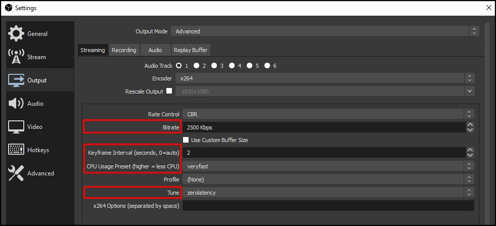
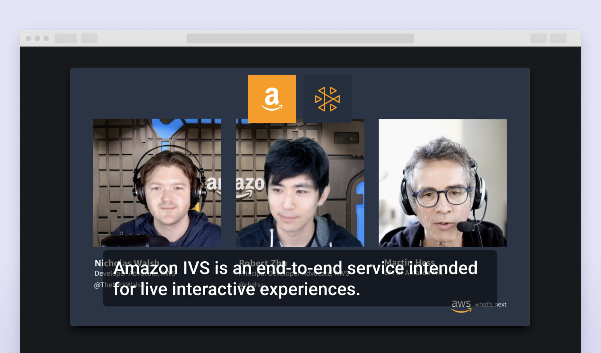

## Deployment

### Prerequisites

* [Node.js version 12.0.0 or later](https://nodejs.org/) to run Node scripts
* [AWS account](https://aws.amazon.com/) to create resources
* [AWS CLI version 2](https://docs.aws.amazon.com/cli/latest/userguide/install-cliv2.html) to run scripts
* [Git Bash](https://git-scm.com/) to run Bash scripts (only on Windows)
* [Docker version 20.10.5 or later](https://www.docker.com/) and Docker daemon up and running to build and push ECS container images

### 1) Assign random suffix to resource names

Run `bash assign-random-suffix.sh`.

This will generate a 6 character length alphanumeric value. Then, it will update the [cloudformation.yaml](./cloudformation.yaml) file and bash script files by replacing the placeholder `<RANDOM_SUFFIX>`, located at the end of the resource names, with the random value generated to ensure uniqueness.

> **Note:**<br>
> There is no script to reverse this step, but you can use Git to discard all changes and go back to the original state.

### 2) Configure AWS CLI

Run `aws configure` to set your credentials and the region where you want the demo resources deployed.

### 3) Change input audio language (optional)

You can change the default input audio language (English) by modifying the following parameters in the [cloudformation.yaml](./cloudformation.yaml) file:

* **AudioLanguageCode**: ISO 639-1 code of the audio language to be transcribed, you can find the corresponding code [here](https://en.wikipedia.org/wiki/List_of_ISO_639-1_codes).
* **AudioLanguageTranscribeCode**: Amazon Transcribe code of the audio language to be transcribed, you can find the corresponding code [here](https://docs.aws.amazon.com/transcribe/latest/dg/supported-languages.html).

> **Notes:**<br> 
> * This demo supports *overlays*, *custom vocabulary* and *vocabulary filter* functionalities only for **English transcriptions**.<br>
> * This demo supports partials only for **English transcriptions**, any other language transcriptions will be displayed with less frequency and may span across more than 2 rows of captions.

### 4) Configure translate languages (optional)

When the deployment script starts execution, you will be prompted for confirmation on whether to enable the **Translate** feature or not. If enabled, other captions languages besides the audio one can be selected when visualizing the stream through the Player. Any [Amazon Translate](https://docs.aws.amazon.com/translate/latest/dg/what-is.html) supported language can be enabled by updating the [Translate Languages file](./translate-languages.json) and setting the desired translation languages value to **true**. If the Translate feature is enabled and no language has been enabled in the file, the **Spanish** translation will be made available by default.

> **Note:**<br> 
> This demo supports partials only for **English transcriptions**, translations will be displayed with less frequency and may span across more than 2 rows of captions.

### 5) Run deployment script

Run `bash deploy.sh`.

This will deploy the demo infrastructure in AWS and then perform the following configuration steps using the default configuration values included in this repo.

* [Configure overlays](../configuration/README.md#configure-overlays)
* [Configure custom vocabulary](../configuration/README.md#configure-custom-vocabulary)
* [Configure vocabulary filter](../configuration/README.md#configure-vocabulary-filter)

> **Note:**<br>
> On MacOS, some steps of the deployment show large outputs that require you to press "q" to continue with the deployment execution.

In case of failure, check the script outputs and the CloudFormation console. Common issues are:
* The Docker daemon is not running (check [how to configure and troubleshoot the Docker daemon](https://docs.docker.com/config/daemon/))
* A service quota has been reached (check [AWS service quotas](https://docs.aws.amazon.com/general/latest/gr/aws_service_limits.html))<br>

After solving the issue, run the cleanup script and then the deployment script again (some error messages stating that the resources could not be deleted may arise during the cleanup process if the deployment was made partially).

<br>

## Usage

At the end of the deploy.sh execution, you will see the following output in the console:




Use the **Stream Server URL** and the **Stream Key** values to configure your streaming tool (we are using [OBS](https://obsproject.com/) in this example):



Check that you have the following Output settings: 

* **Bitrate:** `2500 Kbps`
* **Keyframe Interval:** `2`
* **CPU Usage:** `veryfast`
* **Tune:** `zerolatency`



Open up the player using the **Player URL** value provided in the console output:



Optionally, you can configure [certain aspects of the demo](../configuration/README.md).

<br>

## Cleanup

Run `bash cleanup.sh`.

This will remove all the resources created during the execution of `deploy.sh`.

<br>

## Scripts included in this folder

This section includes details of every script present in this folder for informational purposes, you need only to run the scripts described in the **Deployment** and **Cleanup** sections above.

<br>

### generate-player-app-env-vars.js

Creates a file with the environment variables for the player-app, after obtaining them from the output file of the CloudFormation deployment (i.e. `stack.json`). This script is called by the [deploy-player-app.sh](#deploy-player-appsh) script.

Parameters:
1) STACK_FILE_PATH (required)

Example:

```shell
node generate-player-app-env-vars.js stack.json
```

<br>

### deploy-player-app.sh

Calls the [generate-player-app-env-vars.js](#generate-player-app-env-varsjs) script to create the .env file with the corresponding environment variables. Then, the required dependencies are installed and the application is built using the previously generated environment variables. Finally, the build files are uploaded to an S3 bucket. This script is called by the [deploy.sh](#deploysh) script.

Parameters:
1) STACK_FILE_PATH (required)

Example:

```shell
bash deploy-player-app.sh stack.json
```

<br>

### setup-images.sh

Creates 2 repositories in the Amazon ECS private resgistry to host the Stream and Transcribe containers images. Then, logs in into the registry and uses the [Stream Dockerfile](../serverless/stream-server/Dockerfile) and [Transcribe Dockerfile]((../serverless/stream-server/Dockerfile)) to build and push the corresponding images. This script is called by the [deploy.sh](#deploysh) script.

Parameters: None

Example:

```shell
bash setup-images.sh
```

<br>

### setup-lambdas.sh

Generates a zip file for each Lambda function located within the [serverless folder](../serverless) by calling the [zip-generator.js](#zip-generatorjs) script. Then, creates an S3 bucket and uploads the Lambda functions zip files into it. This script is called by the [deploy.sh](#deploysh) script.

Parameters: None

Example:

```shell
bash setup-lambdas.sh
```

<br>

### create-stack.sh

Creates the CloudFormation stack using the specified stack name and the [cloudformation.yaml file](./cloudformation.yaml). This script is called by the [deploy.sh](#deploysh) script.

Parameters:
1) STACKNAME (required)

Example:

```shell
bash create-stack.sh ivs-transcribe-demo-stack
```

<br>

### zip-generator.js

Generates a zip file for each specified folder. This script is called by the [setup-lambdas.sh](#setup-lambdassh) script.

Parameters:
* FOLDER_PATH (variable)

Example:

```shell
node zip-generator.js ../serverless/lambda-on-connect ../serverless/lambda-on-disconnect ../serverless/lambda-send-transcription
```

<br>

### deploy.sh

Main script used to perform the demo deployment. It calls the following scripts:

1) [setup-lambdas.sh](#setup-lambdassh)
2) [setup-images.sh](#setup-imagessh)
3) [create-stack.sh](#create-stacksh)
4) [deploy-player-app.sh](#deploy-player-appsh)
5) [configure-all.sh](../configuration/README.md#configure-allsh)
6) [generate-output.js](#generate-outputjs)

Parameters: None

Example:

```shell
bash deploy.sh
```

<br>

### cleanup.sh

Removes all the demo resources that were created by [deploy.sh](#deploysh).

Parameters: None

Example:

```shell
bash cleanup.sh
```

<br>

### assign-random-suffix.sh

Generates a 6 character length alphanumeric value and assigns it to every `<RANDOM_SUFFIX>` placeholder located in the following files:

* [configure-all.sh](../configuration/configure-all.sh)
* [configure-custom-vocabulary.sh](../configuration/configure-custom-vocabulary.sh)
* [configure-overlays.sh](../configuration/configure-overlays.sh)
* [configure-vocabulary-filter.sh](../configuration/configure-vocabulary-filter.sh)
* [create-custom-vocabulary.sh](../configuration/create-custom-vocabulary.sh)
* [create-vocabulary-filter.sh](../configuration/create-vocabulary-filter.sh)
* [setup-images.sh](./setup-images.sh)
* [setup-lambdas.sh](./setup-lambdas.sh)
* [deploy-player-app.sh](./deploy-player-app.sh)
* [cleanup.sh](./cleanup.sh)
* [cloudformation.yaml](./cloudformation.yaml)

Parameters: None

Example:

```shell
bash assign-random-suffix.sh
```

<br>

### generate-output.js

Generates the outputs needed to run the demo, specifically:

* **Stream Server URL**
* **Stream Key**
* **Player URL**

To retrieve the values, it uses the CloudFormation *stack.json* output file and the AWS SDK. This script is called by [deploy.sh](#deploysh) after deploying all the needed resources.

Parameters:
* `--stackOutputFilePath`: Path to CloudFormation output file (required).

Example:

```shell
node generate-output.js --stackOutputFilePath stack.json
```

<br>

### delete-api-stages.js

Deletes the **demo** stage created for both API Gateways (Reader WebSocket and Writer WebSocket). This script is called by the [cleanup.sh](#cleanupsh) script prior to remove the stack.

Parameters:
* `--stackOutputFilePath`: Path to CloudFormation output file (required).

Example:

```shell
node delete-api-stages.js --stackOutputFilePath stack.json
```
