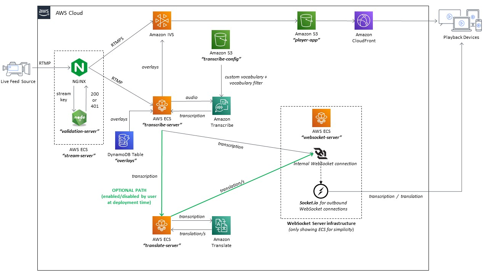
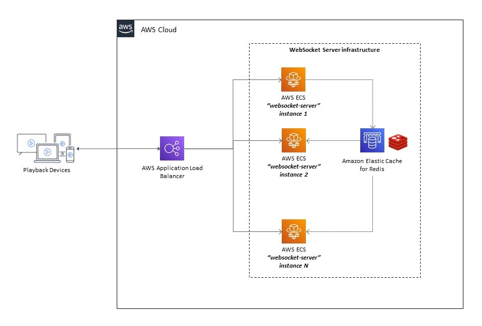

# Alternative WebSocket implementation
The current caption delivery architecture in this solution has a limit of 200 concurrent connected viewers. Starting from 200 connected users and up, the execution time of the process to deliver the captions to connected clients increases and causes a timeout in the Lambda function (which is set at 3 seconds), resulting in no captions being delivered at all.

A possible alternative approach to overcome this limitation would require replacing the WebSocket infrastructure used in this demo (built on top of API Gateway, Lambda and DynamoDB) with a custom WebSocket Server implementation running in AWS ECS and Fargate.

Key changes:
* Remove the current WebSocket infrastructure that relies on API Gateway and Lambda. The "on connect", "on disconnect" and "send transcription" functions would no longer be necessary.
* API Gateway would no longer be required, as it was used as the gateway to the Lambdas that handle the websocket operations.
* The DynamoDB table that holds the WebSocket connections would no longer be necessary.
* The new WebSocket server that handles broadcasting the transcriptions to all connected clients is implemented as a container running in AWS ECS and Fargate (same way as the Transcribe Server or the Translate Server in the current solution).
* Create a server as a new ECS service that leverages communication mechanism like [Socket.IO](https://socket.io/) for handling all WebSocket connections.


Below is an architecture diagram showing an alternative WebSocket implementation using Socket.IO:




Below is a code snippet showing a possible implementation of such WebSocket server:

```javascript
const WebSocket = require('ws');
const { createServer } = require('http');
const { Server } = require('socket.io');

const {
  INPUT_PORT,
  OUTPUT_PORT,
} = require('./constants');


// OUTPUT CONNECTIONS AND MESSAGES (connected clients)
const httpServer = createServer();
const webSocketServerOutput = new Server(httpServer, {
  cors: {
    origin: "*"
  }
});
httpServer.listen(OUTPUT_PORT);

webSocketServerOutput.on('connection', (socket) => {
  console.log(`[webSocketServerOutput connection event] socket connected:\n${socket}`);
});


// INPUT CONNECTIONS AND MESSAGES (Transcribe + Translate)
const webSocketServerInput = new WebSocket.Server({ port: INPUT_PORT });

webSocketServerInput.on('listening', () => {
  console.log(`[webSocketServerInput listening event] Server is listening for input messages on port ${INPUT_PORT}`);
});

webSocketServerInput.on('connection', (webSocket) => {
  console.log(`[webSocketServerInput connection event] webSocket:\n${webSocket}`);

  webSocket.on('message', async (message) => {
    console.log(`[webSocketServerInput message event] Received Message:\n${message}`);

    const parsedMessage = JSON.parse(message);
    webSocketServerOutput.sockets.emit('message', parsedMessage); // Here we broadcast the received message to all the connected users
  });

  webSocket.on('close', (statusCode, reason) => {
    console.log(`[webSocketServerInput close event] Connection Closed. Status code: ${statusCode}, Reason: ${reason}`);
  });
});
```

> **Note:** Notice that there are 2 WebSocket connections in 2 different ports: one used for receiving internal messages from Transcribe and Translate services; the other one using Socket.IO to handle connections with external users and broadcast the messages containing the captions.

<br/>

### WebSocket server scalability

The WebSocket server implementation discussed in this document is intended as a possible workaround. As such, it is not intended for production usage, as it relies on a single ECS container exposed to the internet. In order to support even more connected clients and to prevent publicly exposing the server containers to the internet, the infrastructure could be expanded and improved to support multiple container instances exposed through [Application Load Balancer](https://aws.amazon.com/elasticloadbalancing/application-load-balancer/) for distributing traffic and improved security capabilities.


<br/>
The diagram below illustrates how that might look like:



About this implementation:

* Application Load Balancer is used to balance traffic across the multiple server instances. Note that due to the nature of the longed lived WebSocket connections between client and server, the load balancer should be configured to use sticky sessions so subsequent requests after the connection is established are routed to the same server instance.

* The Redis component in the diagram is the Redis Adapter for Socket.IO [(@socket.io/redis-adapter)](https://socket.io/docs/v4/redis-adapter/) which replaces the default in-memory implementation by a message broker using the pub/sub mechanism in Redis so events are properly routed to all clients in all Socket.IO server instances.
